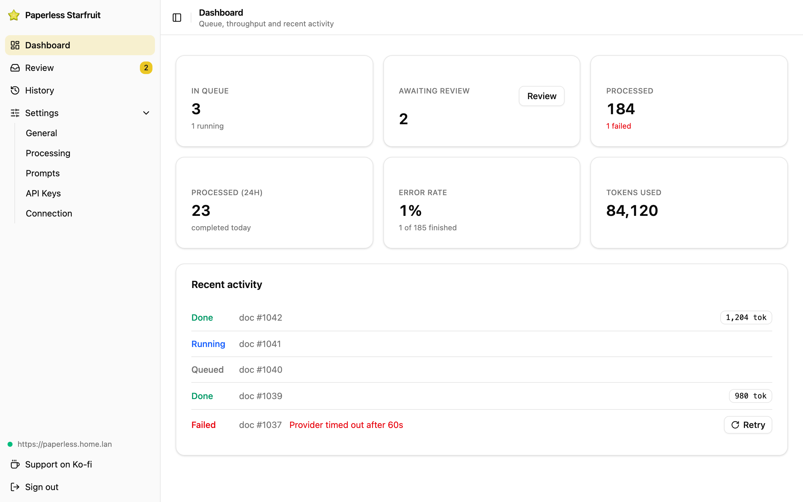
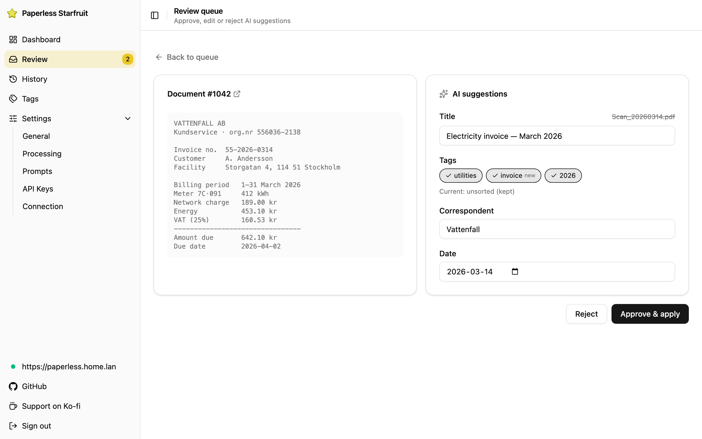
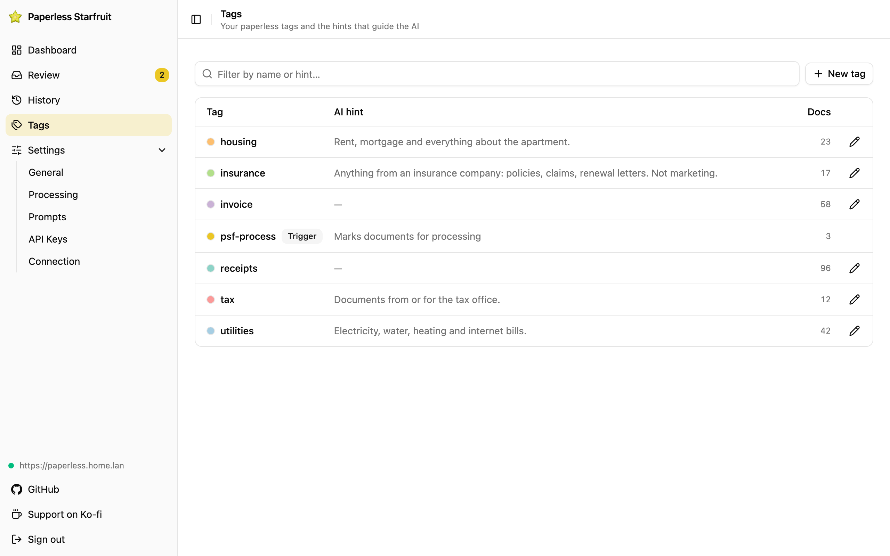
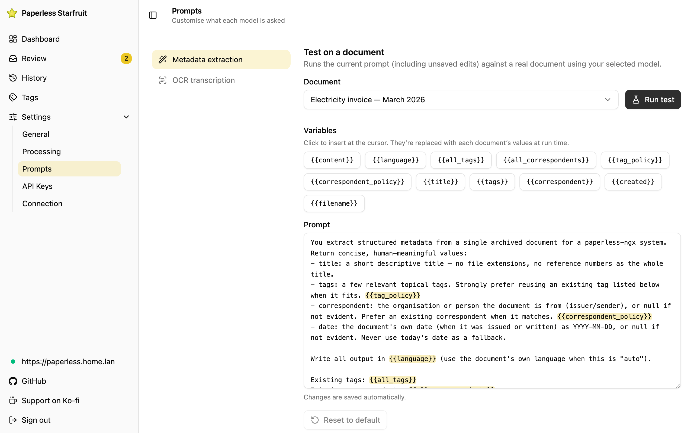

#  Paperless Starfruit

A self-hosted, bring-your-own-keys AI companion for [paperless-ngx](https://docs.paperless-ngx.com/):
better OCR and automatic titles, tags, correspondents and dates — configured entirely from a web UI.

**[Website](https://paperless-starfruit.vercel.app/)** · **[Docs](https://paperless-starfruit.vercel.app/docs/)** · **[Install](https://paperless-starfruit.vercel.app/docs/installation/)**

[](https://github.com/sabbaken/paperless-starfruit/actions/workflows/ci.yml)
[](https://github.com/sabbaken/paperless-starfruit/actions/workflows/api-publish.yml)

<table>
  <tr>
    <td></td>
    <td></td>
  </tr>
  <tr>
    <td></td>
    <td></td>
  </tr>
</table>

## Stack

- **Monorepo:** Turborepo + pnpm
- **Backend:** NestJS (HTTP API + cron poller + in-process worker), SQLite via Drizzle, self-written table queue
- **Frontend:** React + Vite + TanStack Query + Tailwind
- **AI gateway:** Vercel AI SDK (structured output via Zod)

## Layout

```
apps/api      NestJS — API + poller + worker, one process (also serves the built SPA)
apps/web      React + Vite admin SPA
packages/shared   Zod schemas, types, constants (FE/BE contract)
```

## How it works

1. You tag a document in paperless-ngx with **`psf-process`**.
2. The poller picks it up, OCRs it (optional) and asks an LLM for a title, tags, correspondent and date.
3. Depending on the **Auto-apply** setting, the result is either written straight back to paperless (and the trigger tag removed), or queued in the **Review** screen for you to approve/edit/reject.

Everything — the paperless connection, provider keys, models, prompts, page limits, polling
interval — is configured in the web UI. The only thing set outside the UI is a handful of
environment variables for the process itself (below).

## Deploy (self-hosting)

A single container, no Postgres/Redis. SQLite lives on a mounted volume. Pre-built images
are published to GitHub Container Registry on every GitHub release (the release tag names the
image version), so there is nothing to clone or build:

```
ghcr.io/sabbaken/paperless-starfruit/api:latest    # or a release version, e.g. :1.1.0, to pin
```

Two compose files, depending on where you start (full walkthrough in the
[installation docs](https://paperless-starfruit.vercel.app/docs/installation/)):

### Already running paperless-ngx

Use [`docker/docker-compose.yml`](docker/docker-compose.yml) — just the Starfruit container.
Put the one required secret in a `.env` next to it and start:

```bash
# Keep ENCRYPTION_KEY stable — see below.
echo "ENCRYPTION_KEY=$(openssl rand -base64 32)" > .env

docker compose up -d
```

To let the container reach paperless, attach it to your paperless stack's Docker network
(see the commented example at the bottom of the compose file) and use the in-network service
name (e.g. `http://webserver:8000`) as the paperless URL in the UI — not `localhost`.

### Starting from scratch (paperless-ngx included)

Use [`docker/docker-compose.full.yml`](docker/docker-compose.full.yml) — Redis +
paperless-ngx + Paperless Starfruit together. This one needs two secrets:

```bash
cat > .env <<EOF
ENCRYPTION_KEY=$(openssl rand -base64 32)
PAPERLESS_SECRET_KEY=$(openssl rand -base64 32)
EOF

docker compose -f docker-compose.full.yml up -d
docker compose -f docker-compose.full.yml run --rm paperless createsuperuser
```

paperless-ngx comes up on **http://localhost:8000** (log in with the superuser you just
created). In the Starfruit UI, set the paperless URL to `http://paperless:8000` — the
in-network service name, not `localhost`.

### First run

Open **http://localhost:7827** — the container serves both the API and the web UI on
the same port. (The compose files publish the app on host port **7827** — deliberately
uncommon so they work as-is; change the left side of the `ports:` mapping to move it.)
On first run, the UI shows a **"create admin"** card; once you set the admin
username/password, registration closes and only login works (there is no default password).

- **Persistence:** the SQLite database is at `/data/app.db` on a named volume. Back that up
  to keep your config, prompts, queue and audit history.
- **Automatic updates:** both compose files ship a Watchtower service that auto-updates the
  Starfruit container when a new image is released (only the labelled container — nothing else
  on the host). Remove the `watchtower` service, or pin a version tag instead of `:latest`, to
  upgrade deliberately.
- **Behind a reverse proxy:** put your TLS terminator (Caddy/Traefik/nginx) in front of the
  published port (`7827` by default). Auth is a bearer token, not a cookie, so no extra
  CORS/cookie config is needed; set `CORS_ORIGIN` only if you want to restrict it.
- **Building from source** (optional): clone the repo, swap `image:` for the commented
  `build:` block in `docker/docker-compose.yml`, then
  `docker compose -f docker/docker-compose.yml up -d --build`.

### Configuration (environment variables)

These four are the _only_ runtime env vars. Everything else is configured in the UI.

| Variable         | Required | Default        | Purpose                                                                                  |
| ---------------- | -------- | -------------- | ---------------------------------------------------------------------------------------- |
| `ENCRYPTION_KEY` | **yes**  | —              | 32-byte key (base64 or hex). Encrypts stored credentials **and** signs admin sessions.   |
| `DATABASE_PATH`  | no       | `/data/app.db` | SQLite file path (its directory is created if missing).                                  |
| `PORT`           | no       | `3000`         | Port the app listens on _inside_ the container (the compose files publish it as `7827`). |
| `CORS_ORIGIN`    | no       | reflect origin | Comma-separated allowed origins. Leave unset unless you want to lock it down.            |

> **Keep `ENCRYPTION_KEY` stable.** Rotating it logs the admin out _and_ makes every stored
> paperless/provider credential undecryptable — you'd have to re-enter them. Store it like any
> other production secret.

Configured in the UI (not env): the paperless URL + token, AI provider keys, model choices,
prompts, page limits, the polling interval, auto-apply, and the correspondent blacklist. Worker
concurrency is fixed at 1 by design (single-user scale — simplicity over throughput).

### Connect paperless (least-privilege)

In the UI's Connection screen, enter your paperless base URL and an API token, and hit
**Test connection**. Leave **API version** blank — it's auto-detected.

Prefer a **dedicated paperless user** over the superuser: create a paperless account that can
_view and change documents_ and _view and add tags and correspondents_, then mint that user's
token (paperless: **Settings → My Profile → API Auth Token**). The token is stored encrypted at
rest. Because this app must reach self-hosted/LAN URLs (paperless on a private IP, a local
Ollama, etc.), the admin-entered URLs are intentionally **not** SSRF-restricted — the security
model is "one trusted admin".

### Configure AI providers

Add provider credentials in the **API Keys** screen. Supported kinds:

- **Anthropic, OpenAI, Google, Mistral** — one API key each; models come from a curated catalog.
- **OpenAI-compatible** — for local/self-hosted endpoints (Ollama, LM Studio, vLLM, OpenRouter);
  set a base URL, the API key is optional, and models are discovered live.

Keys are encrypted at rest (AES-GCM) and never returned to the browser unmasked. Pick the default
LLM and OCR models in the **Processing** screen.

## Development

```bash
pnpm install
cp .env.example .env   # then set ENCRYPTION_KEY (see the comment in the file)
pnpm dev               # run api (:3000) + web (:5173) together
```

Open **http://localhost:5173** — the web dev server proxies `/api` to the API on port 3000.
(In production the API serves the built SPA itself on the same port.)

- **Migrations apply automatically on API boot**, so there's no separate migrate step for a normal
  run. `pnpm db:generate` (regenerate a migration after a schema change) and `pnpm db:migrate`
  (apply migrations standalone, e.g. in CI) remain available.
- `ENCRYPTION_KEY` is required to save credentials. The API reads `.env` from `apps/api/` or the repo root.

## Local paperless-ngx for testing

A throwaway paperless-ngx instance to develop against (SQLite + Redis, default
`admin` / `admin` login — dev only):

```bash
pnpm paperless:up       # start paperless on http://localhost:8000 (first boot ~30-60s)
pnpm paperless:token    # print an API token for the admin user
pnpm paperless:logs     # tail paperless logs
pnpm paperless:down     # stop it
```

Then in the onboarding screen use `http://localhost:8000` and the token. Drop PDFs/images into
`docker/paperless-consume/` to have paperless ingest them, and tag one `psf-process` to test.

## Build

```bash
pnpm build
```
